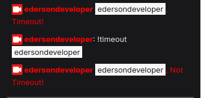
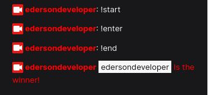

# Urano

Urano is a CLI program to create twitch chat bots with simplicity.

# Dependencies

You will need `nodejs` and `sed` to use Urano. in any UNIX system the sed is pre-installed, but, if you don't have Nodejs [install it in the official site](https://nodejs.org/en/)

# Install

To install Urano run this command:

`npm install -g uranotwitch`

# Usage

## Create a new bot

To create a new twitch bot, first, create a directory. This directory will have all your twitch chatbot code.

```
mkdir MyBot
cd MyBot
```

And now, you can run the command to create a new bot

`urano -c`

or

`urano --create`

And the Urano will ask about the bot username, password (token) and the bot twitch channel.

```
$ urano --create
What is the bot username?: MyBot
Paste the bot token here: my-token
What is the channel of the bot?: myTwitchChannel
```

Now, you can run `npm install` to install all depencies of your twitch chatbot.

## Adding a command

To add a new command, run:

`urano -a`

or

`urano --add`

And now, Urano will ask you the type of command.

```
$ urano --add
[1] Simple Command
[0] CANCEL

What type of command do you want? [1/0]:
```

### Simple Command

Simple Command is a command what will ever return the same text, replying or not the user what called the command.

Urano will ask about the command, the result of the command and if the command will reply or not the user what called the command.

```
[1] Simple Command
[2] Pre-Build Commands
[0] CANCEL

What type of command do you want? [1/0]: 1
What is the command? (without !): mycommand
What is the result of the mycommand?: this is my command
Reply the user in the mycommand message? [y/n]: y
```

### Pre-Build Commands

Pre-Build Commands are a group of commands like Timeout command, what you need to complete the informations and you can add it to your chatbot.

```
[1] Simple Command
[2] Pre-Build commands
[0] CANCEL

What type of command do you want? [1, 2, 0]: 2

[1] Timeout Command
[0] CANCEL

What Pre-Build command do you want? [1/0]:
```

#### Timeout Command

You can add a Timeout Command to your chat, defining the command, the probability of the ban occurs, the timeout length, the message if the ban occurs and the message if the ban not occurs

```
[1] Timeout Command
[2] Giveaway Command
[0] CANCEL

What Pre-Build command do you want? [1/0]: 1
What is the command? (without !): timeout

[1] 0.1
[2] 0.2
[3] 0.3
[4] 0.4
[5] 0.5
[6] 0.6
[7] 0.7
[8] 0.9
[0] CANCEL

Which probability? [1...8 / 0]: 5
What is the timeout length? (in seconds): 10
What is the message if the ban occurs?: Timeout!
What is the message if the ban not occurs?: Not Timeout!
```

Now you have the timeout command in your Stream!



#### Giveaway Command

You can add a giveaway command to your chat. defining the start, enter, end and message of resutl.

```
[1] Timeout Command
[2] Giveaway Command
[0] CANCEL

What Pre-Build command do you want? [1, 2, 0]: 2
What is the start giveaway command? (without !): start
What is the enter giveaway command? (without !): enter
What is the end giveaway command? (without !): end
What is the text of giveaway result?: Is the winner!
```



## Runing the your bot

Now, you can run the bot using `npm run serve` or `node index.js`, and now, your bot is working!
